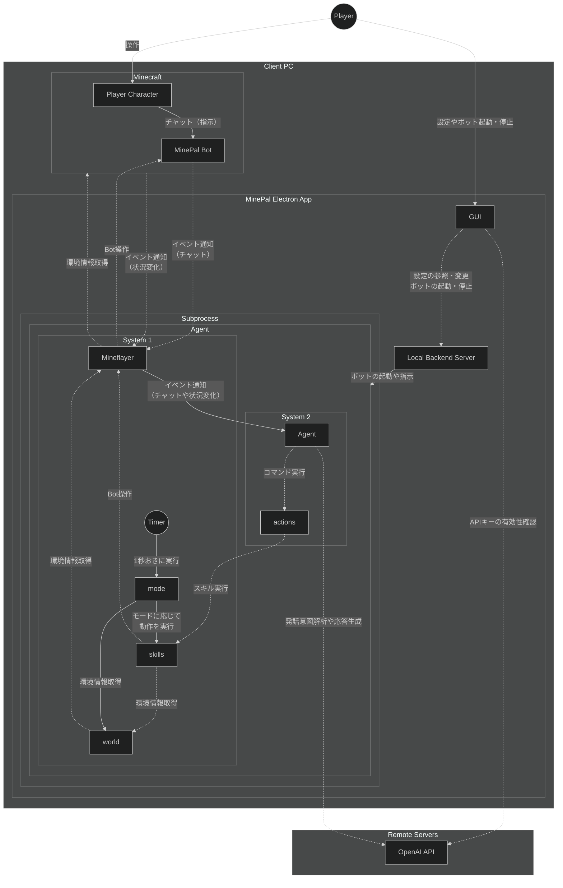

# MinePal

## Overview

MinePal is a Minecraft companion app with a React frontend, a local backend, and an AI agent.

## Structure



## ビルド手順

### 前提条件

ビルドに必要な環境

- node.js v20

### 1. フロントエンドのビルド

Electronアプリケーションのビルドの前準備としてまずはフロントエンドをビルドする必要がある。

1. フロントエンドのあるディレクトリ `frontend` に移動する。

   ```sh
   cd frontend
   ```

2. 依存ライブラリをインストールする。

   ```sh
   npm install
   ```

3. ビルドを実行する。

   ```sh
   npm run build
   ```

   ビルドが成功すると `frontend/dist/` ディレクトリの中にHTML/JS/CSS等のファイルが出力される。

### 2. Electronアプリケーションのビルド

1. `MinePal` ディレクトリ直下に戻る。

   ```sh
   cd ..
   ```

2. 依存ライブラリをインストールする。

   ```sh
   npm install
   ```

3. ビルドを実行する。

   ```sh
   npm run buildLocal
   ```

   ビルドが成功すると `dist/` ディレクトリの中にバイナリが出力される。  
   コードのテストが目的であれば、時間のかかるビルドを行うのではなく、次のコマンドを実行すればすぐアプリケーションを起動することができる。

   ```sh
   npm run start
   ```
